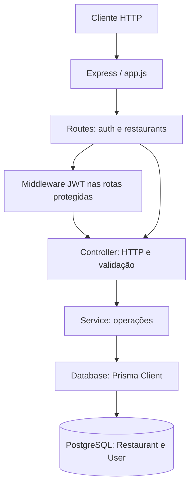

# EasyFood - Respostas e evolução das missões

## Missão 1 - Cadastro de restaurantes
1. A API precisa receber dados, validar e criar um restaurante, além de listar.
2. A nova rota é POST /restaurants: POST representa criação de um recurso.
3. O corpo JSON contém name, category e rating; nome e categoria são obrigatórios, avaliação omitida assume zero.
4. O cliente envia Content-Type: application/json; express.json() disponibiliza req.body.
5. Na primeira versão o registro entrava em um array. Na versão atual é gravado no PostgreSQL.
6. No protótipo não era necessário um componente externo: a nova rota usava o conector HTTP existente. Com persistência, acrescentamos PostgreSQL e o conector de acesso via Prisma.
7. Decisão: iniciar com armazenamento em memória para validar o fluxo rapidamente; alternativa: banco desde o primeiro dia. Vantagem: simplicidade. Desvantagem: perda de dados. Ver ADR-001 e sua substituição pelo ADR-002.

## Missão 2 - Persistência e decisões
1. Escolha: PostgreSQL, pela persistência, integridade e adequação a entidades relacionadas.
2. O push do array é substituído por prisma.restaurant.create; o GET usa findMany.
3. Prisma Client e Prisma Migrate são as dependências de acesso e evolução do esquema.
4. Inicialmente essas chamadas estariam no server.js; após a Missão 4 ficam no service, com conexão em database/prisma.js.
5. O desenho passa de Cliente -> API -> Array para Cliente -> API -> Prisma -> PostgreSQL.
6. Ganhamos durabilidade e dados compartilhados; assumimos infraestrutura, credenciais, disponibilidade e migrations.
7. O teste que perdia dados em memória é uma observação histórica do exercício. A verificação automatizada atual encerra e inicia outro processo da API e confirma que o registro continua no PostgreSQL.

## Missão 3 - PostgreSQL e Prisma
1. Resolvemos a perda de dados quando a API reinicia.
2. PostgreSQL atende à estrutura relacional e às futuras relações entre usuários, restaurantes e pedidos.
3. Prisma traduz operações do cliente em acesso ao banco; migrations versionam o esquema. A persistência é responsabilidade do PostgreSQL.
4. Sem banco, o servidor falha na conexão inicial; se a conexão cair durante a execução, operações dependentes do banco retornam erro 500 sem expor detalhes internos.
5. Ganhamos armazenamento durável e restrições, ao custo de um serviço externo, configuração, backups e latência de I/O.
6. O desenho deve incluir Prisma, PostgreSQL e seu conector. Ver ADR-002.

## Missão 4 - Camadas e autenticação
1. Evitamos concentrar responsabilidades no server.js para facilitar entendimento e manutenção.
2. server.js carrega configuração, inicia HTTP e encerra conexões; app.js monta middlewares e módulos.
3. Routes mapeiam método/caminho; controller recebe req/res, valida e escolhe a resposta.
4. Service executa operações de domínio; database/prisma.js centraliza uma instância do Prisma.
5. Sem req/res, o service pode ser reutilizado em scripts e outros contextos sem depender de HTTP.
6. Routes não acessam Prisma para não misturar roteamento com persistência.
7. A refatoração preserva GET e POST. Na Atividade 5, o POST passa deliberadamente a exigir autenticação.
8. Ganhamos localização das responsabilidades; adicionamos mais arquivos e chamadas entre camadas.
9. O módulo auth foi implementado. Pesquisa, alternativas, escolha e trade-offs estão no ADR-004.

## Atividade 5 - Fluxo de autenticação
Cadastro -> bcrypt -> hash no PostgreSQL. Login -> bcrypt.compare -> JWT de um dia. Authorization: Bearer -> middleware -> controller da rota protegida.

GET /restaurants é público; POST /restaurants e GET /auth/me exigem token. Cadastro retorna 201 sem senha; e-mail duplicado retorna 409; credenciais incorretas ou token ausente/inválido/expirado retornam 401; entrada inválida retorna 400.

## Arquitetura final

